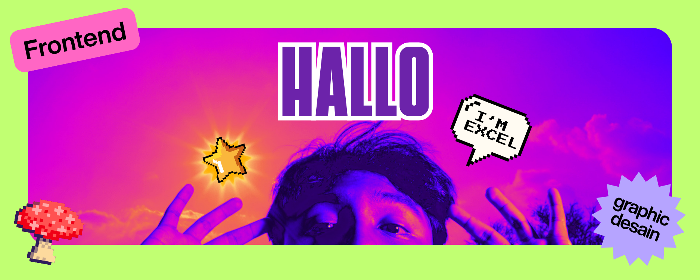

<!-- Header -->

<h1 align="center">Excelliotheobald</h1>


<!-- Banner -->

<p align="center">

</p>
Frontend Developer & Graphic Designer crafting clean, modern, and user-focused digital experiences.

<br>

<H1 align="center">TECH STACK</H1>

<p>


</p>

<p >


</p>

<br>

## Current Focus

```txt
▢ Building modern web interfaces
▢ Learning backend architecture
▢ Exploring authentication
▢ Improving UI/UX design
▢ Writing cleaner TypeScript
```

<br>

## Connect with me

<p align="center">

<a href="https://instagram.com/excel.halilintar">
  
</a>

<a href="mailto:excelhalilintar@gmail.com">
  
</a>

<a href="https://github.com/Excelliotheobald">
  
</a>

</p>

<br>

<p align="center">
  
</p>
